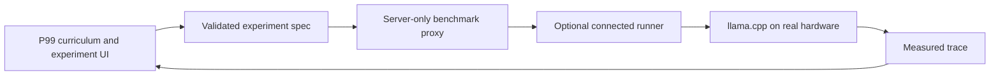

# P99 architecture

P99 currently has three layers.

## 1. Curriculum and experiment specification

`app/page.tsx` contains the guided foundations, experiment builder, and incident workflow. `lib/inference/experiment.ts` defines the allow-listed serving controls and fixed workload metadata.

This layer teaches what to change and what to observe. It does not calculate performance.

## 2. Server-only benchmark proxy

`app/api/benchmark/route.ts` validates every requested configuration and proxies jobs to an operator-configured runner. The runner URL and authentication key remain server-side. If no runner is configured, the UI shows an explicit unavailable state and returns no substitute result.

## 3. Optional ephemeral GPU runner

`cloud/modal_benchmark.py` exposes an authenticated, allow-listed job API. Each job:

1. provisions one T4, L4, or A10G with a hard timeout;
2. starts llama.cpp with an official Qwen2.5-7B GGUF quantization;
3. runs the fixed workload;
4. samples llama.cpp metrics and `nvidia-smi` telemetry;
5. returns a measured trace;
6. terminates with the function container.

Arbitrary repositories, shell arguments, durations, and GPU types are not accepted from the browser.

## Future architecture

Bring-your-own-environment adapters would normalize traces from local llama.cpp, workstation GPUs, clusters, and cloud providers. A future learned system-dynamics model could then train on measured state transitions and predict the next state under an intervention. It should be introduced only after there is enough diverse measured data to evaluate generalization honestly.
