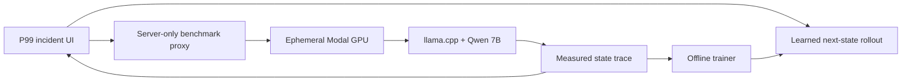

# P99 architecture

P99 has three deliberately separate layers.

## 1. Learned dynamics surrogate

`lib/inference/learned-dynamics.ts` recursively applies a generated 19-input, 24-hidden-unit, 6-output MLP. Its state is:

`queue depth + active requests + VRAM + GPU utilization + throughput + p95 latency`

Each step is conditioned on the previous state, serving configuration, workload, and rollout progress. The prediction becomes the next input, creating a recursive learned trajectory rather than a single outcome regression. An explicit SLO head derives end-to-end tail latency and the mission score from the predicted system state.

The generated weights and training metadata are in `lib/inference/learned-dynamics-weights.ts`. `scripts/train_learned_dynamics.mjs` can fit the model from normalized trace transitions.

## 2. Independent validation

The default reference path calls the deterministic educational engine in `lib/inference/engine.ts`. It does not share learned weights with the surrogate. This preserves a fast, repeatable demo and makes forecast error visible.

When configured, `app/api/benchmark/route.ts` instead creates and polls a real GPU job. The API key remains server-side.

## 3. Ephemeral GPU trace runner

`cloud/modal_benchmark.py` exposes an authenticated, allow-listed job API. Each job:

1. provisions one T4, L4, or A10G with a ten-minute hard timeout;
2. starts llama.cpp with an official Qwen2.5-7B GGUF quantization;
3. replays the fixed 2.4 request/second workload;
4. samples llama.cpp Prometheus metrics and `nvidia-smi` telemetry;
5. saves a versionable trace and returns its observed summary;
6. terminates with the function container.

Arbitrary repositories, shell arguments, durations, and GPU types are not accepted from the browser. This bounds both attack surface and spend.

